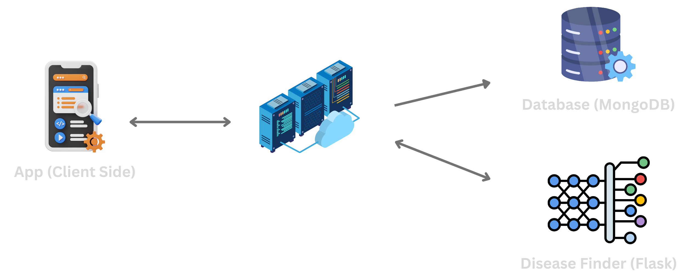

# SymToDoc

**SymToDoc** is a React Native mobile application designed to empower users with fast, accessible, and intelligent health insights. By simply selecting their symptoms, users receive a list of potential diseases ranked by probability, along with recommended medical specializations to consult, bridging the gap between uncertainty and informed action.

---

## 🩺 What is SymToDoc?

SymToDoc is your pocket health assistant. The app allows users to:

- 🔐 Create a secure account and log in.
- 🧭 Access a personalized dashboard.
- 🧠 Select from a list of symptoms to get potential disease predictions.
- 📊 View diseases ranked by likelihood (most probable shown first).
- 👨‍⚕️ Get guidance on which type of medical specialist to consult for each possible condition.

It’s built with the goal of aiding early detection, reducing misdirection, and promoting timely medical intervention.

---

## ✅ Key Benefits

- **🎯 Accurate & Prioritized Results**  
  Receive diseases ranked by probability, helping users understand which conditions are most likely based on their symptoms.

- **👨‍⚕️ Specialist Guidance**  
  Know exactly which type of doctor to see for each predicted condition, no more guessing or unnecessary referrals.

- **📱 Seamless User Experience**  
  With an intuitive interface and responsive design, SymToDoc offers a smooth journey from sign-up to diagnosis insights.

- **🔐 Secure & Personalized Access**  
  Each user has their own secure dashboard to manage symptoms and view tailored results.

- **🌍 Healthcare Accessibility**  
  Especially helpful in regions with limited access to immediate medical advice, enabling quicker awareness and proactive decisions.


---

## 🏗️ Project Architecture

SymToDoc is built using a modular and scalable architecture, integrating multiple technologies across the frontend, backend, and machine learning layers.


### 🧩 Architecture Overview

---

### 🔹 Frontend: React Native

- Provides an intuitive and responsive UI for account creation, login, symptom selection, and results display.
- Handles user navigation and state management across screens (dashboard, disease results, etc.).

---

### 🔹 Backend API: Express.js

- Acts as a middleware between the frontend and the Flask ML server.
- Handles:
  - User authentication (sign-up/login)
  - Session management
  - Routing API requests
- Ensures secure and organized communication flow between components.

---

### 🔹 Machine Learning Server: Flask + Random Forest

- A dedicated Python-based service using Flask.
- Receives symptom input from the Express server.
- Uses a trained **Random Forest** model to:
  - Analyze symptom patterns.
  - Predict possible diseases ranked by probability (weights).
  - Recommend relevant medical specialists for each disease.

---

### 🔹 Database: MongoDB

- Stores user credentials, session data, selected symptoms, and prediction history.
- Provides a scalable NoSQL solution to efficiently manage dynamic and unstructured health-related data.

---

This layered architecture ensures:
- 🔁 Loose coupling between services.
- 📈 Scalable and maintainable development.
- 🔐 Secure and efficient data handling.
- ⚡ Real-time and intelligent health predictions.


---

## ⚙️ Installation & Setup

Follow the steps below to run the **SymToDoc** project locally. The repository consists of three main directories:

- `client` – React Native frontend
- `disease_finder` – Flask server with machine learning model
- `server` – Express.js backend API

---

### 1️⃣ Clone the Repository

```bash
git clone https://github.com/srniloy/SymToDoc.git
cd SymToDoc
```

### 📱 Client Setup (React Native)

```bash
cd client
# Go to src/constants/values.ts and change:
# BASE_URL=your_server_url
# Then run:
npm install
npm run start
```

### 🧠 Disease Finder Setup (Flask + ML Model)

```bash
cd disease_finder

# Create and activate virtual environment
python -m venv venv
# On Windows:
venv\Scripts\activate
# On macOS/Linux:
source venv/bin/activate

# Install required packages
pip install -r requirements.txt

# Run the Flask app
python app.py
```

### 🔐 Server Setup (Express.js API)

```bash
cd server

# Create a `.env` file in the root of this directory and add the following:
# PORT=your_port
# MONGO_URL=your_mongo_connection_string
# HASH=your_secret_hash
# DISEASE_FINDER_URL=http://localhost:your_flask_port

# Then run:
npm install
npm run dev
```

---

## 📲 Download & Try the App

You can try **SymToDoc** by downloading and installing the app

*As the server is deployed in Render, it usually take 50 to 60 seconds only for the first request. As a result authentication may need sometime*

### 🔗 Download from Expo

> [Click here to open the app in Expo](https://expo.dev/accounts/srniloy/projects/sym-to-doc/builds/2c379a23-cb33-4d2b-bd73-15af1e841814)  
> *(go to Build artifact section and click the install button and the apk of this app will start downloading!)*

1. Install the **SymToDoc** app
2. Login with the provided test credentials or you can signup also.
3. Select the symptoms you are facing and click **Analyze Symptoms** button

---

### 🧪 Test Credentials

Use the following dummy credentials to log in and explore the app:

```txt
📧 Email: testuser@symtodoc.com  
🔑 Password: test1234
```


